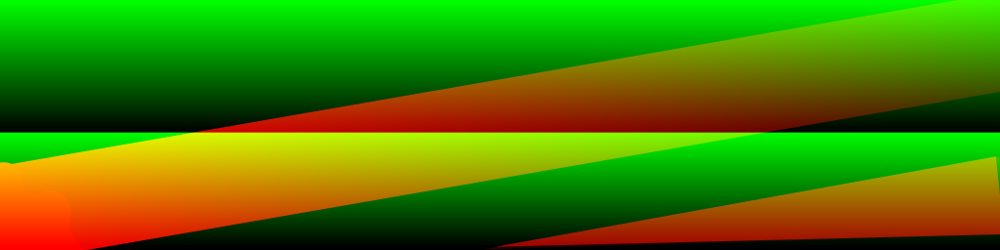

# DbSpectral Chugin

## Intro

> Imagine turning a [graphic equalizer](https://en.wikipedia.org/wiki/Equalization_(audio)#Graphic_equalizer)
> on its side. Next, imagine stacking a __bunch__ of equalizers next to each 
> other with different settings for each segment of your composition. Now take
> a picture of these settings to produce an image.  Here, a pixel's brightness 
> represents the equalizer's slider position. If you're still with us, take out 
> your favorite paint package (or use Fiddle's built-in one) and start editing 
> or drawing patterns that represent the filter changes. Finally combine this
> image, an input signal, and `DbSpectral` to obtain intuitive and complete
> control over the spectral filter and delay effects.

## Overview 

`DbSpectral` is a time-varying audio filter described by an image file.
DbSpectral reads image files (.png) representing a 
[spectrogram](https://en.wikipedia.org/wiki/Spectrogram). Each color
channel (R, G, B) of your image controls a different aspect of the filter
according to its `Mode` setting.

The image y-axis is interpretted as uniformly sampled frequency from 
high at y=0 to low at y=imageHeight. The image x-axis is interpretted 
as time and you can define a _scanning rate_ (measured in pixels/second) 
to control the rate at which the current filter weights are updated.

Consider this image representing controls over _both_ EQ and Spectral Delay.

<center></center>

If we view the __red__ channel alone we see this:

<center></center>

Keeping in mind that time goes from left to right, we can interpret this image
as a bandpass filter that sweeps through a controllable range of frequencies.
Now if we view the __green__ channel alone we see this:

<center></center>

Here, pixels represent spectral delay periods and so we can infer that
black pixels (low and middle frequencies in the controllable frequency range)
have no delay while white pixels have maximum delay. Here, we don't vary
delay amounts through time, but there's no reason not to.  When you change
delay over time you can obtain interesting/bizarre spectral pitch-shifting 
effects.

In this example we only employ 2 image channels.  DbSpectral currently supports 
three and interprets the __blue__ channel as the amount of delay feedback.

## Tips and Caveats

* Interesting temporal effects can be achieved with thin (selecting a narrow 
  band of frequencies), sloping (changing the frequency band) lines. 
* Since spectograms represent linear frequency and since "most" of the 
  interesting auditory stuff happens below 10KHz, you may associate a
  frequency range to your image. Keep in mind that the combination of
  FFT size and frequency range conspire to reduct the number of valid
  _bins_ to associate with your image.
* We currently operate on 8-bit pngs.  It's not clear if more precision 
  is called for.

## Details

We compute the FFT of the incoming signal and multiply the frequency-space
result by the values in the current column of your image. The result is
converted back to the time-domain and sent to the filter output. When loaded,
your image is resized so that the vertical dimension matches the size of 
the requested frequency subset of the FFT.  

For example, an FFT of size 1024 produces 512 complex frequency bins.  The 
normalized pixel value at [x, y] is multiplied by both components of the FFT 
prior to performing the IFFT.  It would be quite easy to support a two-channel 
image specification of these weights, but for now, we've haven't found 
sufficient justification.

Files are loaded in a separate thread to prevent hiccups in the
audio/realtime thread.  This also affords us the opportunity to load new
images during a live performance.

The FFT/IFFT is also computed in a separate thread so as not to bog down the
realtime audio thread.  We apply Hann windowing to the signal (pre and post 
transform) and have a controllable overlap.

Currently we "point-sample" the column data. If this presents a problem
image-scale your input in x and modify `scanRate` accordingly.


## Example

```
// "On The Run" without any of the good stuff.
// DbSpectral example, EQ only.
DbSpectral filt => dac;
BlitSquare sqr => filt;
sqr.gain(.3);
filt.init(2048/*fft*/, 512/*overlap*/, 0/*EQ only*/);
filt.gain(1);
filt.mix(1);
filt.delayMax(0);
filt.loadSpectogram(me.dir() + "image1.png"); // async
filt.scanRate(30);
[52, 55, 57, 55, 62, 60, 62, 64] @=> int notes[];
-5 => int transpose;
160 => float bpm;
(60/bpm) * 1::second => dur beatDur;
beatDur * .25 => dur noteDur;
while(true)
{
    for(int j;j<20;j++)
    {
        for(int k;k<notes.size();k++)
        {
            Math.mtof(notes[k] + transpose) => sqr.freq;
            noteDur => now;
        }
    }
}
```
Here's the control image. When listening to the example, try to guess
which column is active at any moment.

<center></center>


## API

| Method                                   | Description                                                                                                                                                                                                                |
| :--------------------------------------- | :------------------------------------------------------------------------------------------------------------------------------------------------------------------------------------------------------------------------- |
| `init(int fftsz, int overlap, int mode)` | Requests an FFT size, overlap and mode. Default is (2048,512,0). Can't be changed during performance. FFT size must be a power of 2. Modes are: 0: EQ (R), 1: EQ+Delay (RG), 2: EQ+Delay+Feedback (RGB).                    |
| `mix(float x)`                           | Controls the mix of wet (1) and dry (0). Default is 1.                                                                                                                                                                     |
| `loadSpectogram(string path)`            | Loads the Spectrogram asynchronously.                                                                                                                                                                                      |
| `scanRate(int columnsPerSecond)`         | Requests a column scanning rate. Default is 100 columns/second.                                                                                                                                                            |
| `int getColumn()`                        | Returns the current scanning column.                                                                                                                                                                                       |
| `float getColumnPct()`                   | Returns the current scanning column as a percent [0-1] of the image width.                                                                                                                                                 |
| `freqMin(int min)`                       | Associates pixels at the bottom of your image to minimum frequency. Default: 40 Hz                                                                                                                                         |
| `freqMax(int max)`                       | Associates pixels at the top of your image to maximum frequency. Default: 4000 Hz                                                                                                                                          |
| `delayMax(float max)`                    | Assigns a max delay value. Default is 0. If you'd like a constant delay value, just set this value. If you'd like a time and frequency-varying delay, change `Mode` (in init) and set the maximum delay (in seconds) here. |
| `feedbackMax(float max)`                 | Assigns a max feedback value to use when delay is activated. Default is .1.                                                                                                                                                |
| `verbosity(int v)`                       | Enables logging of various internal state changes. Default is 0.                                                                                                                                                           |


## Credits

DbSpectral is built atop several open-source components:

* [Ooura FFT](https://github.com/biotrump/OouraFFT)
* [stb_image](http://nothings.org/stb)
* [stb_image_resize](http://nothings.org/stb)
* [ringbuffer](https://github.com/jnk0l3/Ring-Buffer)

DbSpectral implements a superset of the capabilities of the 
[Spectacle chugin](../Spectacle) by supporting time-varying, image-based 
parameterization.

## Copying

DbSpectral is open-source.  Sub-components are subject to their own
licenses.  Unless otherwise stated, this code is copyright Dana Batali, 
2022 and MIT licensed.