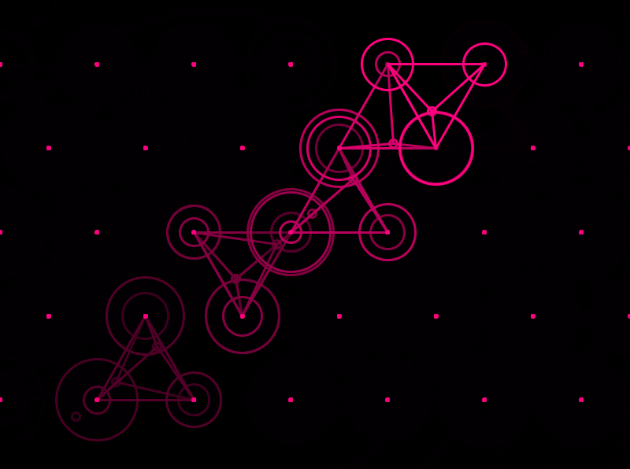

MIAP
====

Chugin Implementation of Manifold-Interface Amplitude Panning (MIAP).

Based on the research of [Zachary Seldess](http://www.zacharyseldess.com/miap/), as presented in his AES paper and conference talk, "MIAP: Manifold-Interface Amplitude Panning in Max/MSP and Pure Data", which in turn is based off the work of Steven Ellison and his first implementation of "Barycentric Panning" in Meyer's SpaceMap&#174; multi-channel panning feature of CueStation.

YouTube links: [Part 1](https://www.youtube.com/watch?v=LUHVwQSkv9s), [Part 2](https://www.youtube.com/watch?v=RKvCAvHo7ZI)

Audio Engineering Socity White Paper (locked behind AES paywall):
> Seldess, Zachary. 2014. "MIAP: Manifold-Interface Amplitude Panning
>   in Max/MSP and Pure Data." Presentation at the annual conference

Steve Ellison article: ["SpaceMap: 20 Years of Audio Origami"](http://www.lightingandsoundamerica.com/reprint/MeyerSpaceMap.pdf)

This implementation is pared down from the Max/MSP object (as one would expect from a ChucK Chugin). The functionality of the various node types (Virtual, Derived) that Seldess describes in his paper can be replicated by linking various nodes to another nodes.

This Chugin is very much open to contributions, and I would like to see it evolve (of course, only if interest is generated, I find this spatial approach very interesting).

Attribution:
This Chugin is based off the work of Zachary Seldess' MaxMSP and Pure Date externsl,
and also based on Meyer Sound’s SpaceMap&#174; multi-channel panning feature of CueStation.
SpaceMap and CueStation are trademarks of Meyer Sound Laboratories, Incorporated.
